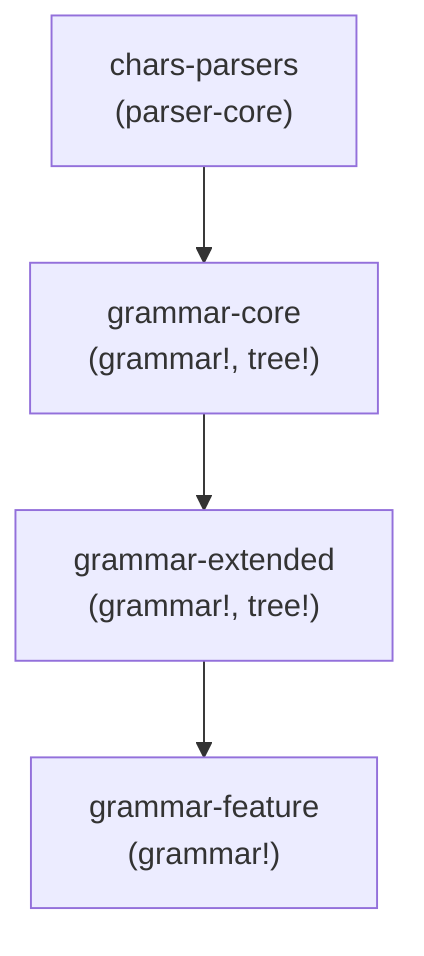

# 
# abstract-parser — proprietary, source-available software (not open-source).    
# Copyright (c) 2025 Abakar Letifov
# (Летифов Абакар Замединович). All rights reserved.
# 
# Use of this Work is permitted only for viewing and internal evaluation,        
# under the terms of the LICENSE file in the repository root.
# If you do not or cannot agree to those terms, do not use this Work.
# 
# THE WORK IS PROVIDED "AS IS", WITHOUT WARRANTY OF ANY KIND.
# 

Слои (каждый новый слой строиться на предыдущем):

- chars-parsers(parser-core)
- grammar-core – простые структуры, правила, выражения
- grammar-extended – джинерики, квантификаторы, выражения в полях структур
- grammar-feature – итоговый пользовательский `grammar!`, все конструкции из предыдущих слоёв